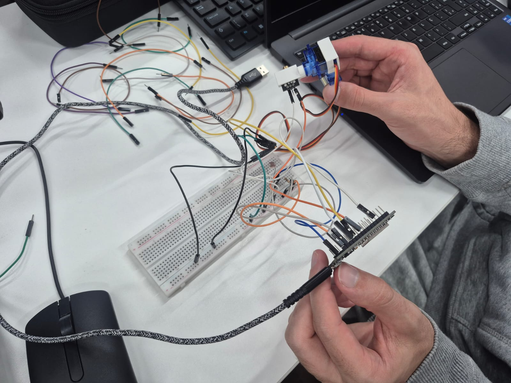

# Sistema de Mira Automatizada com ESP32

> **Disciplina: Edge Computing**

---

## Demonstração do Projeto

### Simulação no Wokwi

🔗 [Acessar Simulação](https://wokwi.com/projects/464304148305328129)

<br>

### Circuito Físico

<p align="center">
  
</p>

---

## Descrição do Projeto

Projeto desenvolvido com ESP32 utilizando Bluetooth, servomotores, laser e sensor LDR para controlar uma mira automatizada.

O sistema permite movimentar a mira horizontalmente e verticalmente através de comandos Bluetooth, além de simular disparos com laser e detectar acertos utilizando um sensor de luminosidade.

---

## Integrantes

| Nome | RM |
|------|----|
| *(André Nobrega)* | *(RM561754)* |
| *(André Gouveia)* | *(RM564219)* |
| *(Caio Carminato)* | *(RM563630)* |
| *(Guilherme Tamai)* | *(RM563276)* |
| *(Mirella Mascarenhas)* | *(RM562092)* |
| *(Vitor Komura)* | *(RM563694)* |

---

## Funcionalidades

- [x] Controle horizontal e vertical da mira
- [x] Comunicação Bluetooth com ESP32
- [x] Acionamento do laser
- [x] Detecção de alvo via LDR
- [x] Sistema de trava automática por 10 segundos
- [x] Reset automático da posição dos servos

---

## Componentes Utilizados

| Componente | Função |
|------------|--------|
| ESP32 | Controle principal |
| Servo Motor | Movimentação da mira |
| Laser | Simulação de disparo |
| LDR | Detecção de alvo |
| Bluetooth | Comunicação remota |

---

## Comandos Bluetooth

| Comando | Ação |
|----------|------|
| F | Cima |
| B | Baixo |
| L | Esquerda |
| R | Direita |
| V / W | Disparo do laser |

---

## Pinos Utilizados

| Pino | Componente |
|------|------------|
| GPIO 14 | Servo Horizontal |
| GPIO 12 | Servo Vertical |
| GPIO 26 | Laser |
| GPIO 34 | LDR |

---

## Tecnologias

- ESP32
- Arduino IDE
- C++
- ESP32Servo
- BluetoothSerial

---

## Conceitos de Edge Computing

O projeto utiliza processamento local no ESP32 para:

- Controle dos servos
- Leitura do sensor LDR
- Comunicação Bluetooth
- Tomada de decisão em tempo real

Sem necessidade de processamento externo ou nuvem.

---

## Observações

- O Bluetooth pode não funcionar corretamente no simulador Wokwi.
- Recomenda-se utilizar um ESP32 físico para testes completos.

---

## Como Executar

```bash
1. Abrir o código na Arduino IDE
2. Selecionar a placa ESP32
3. Instalar as bibliotecas necessárias
4. Fazer upload do código
```

---

## Licença

Projeto acadêmico desenvolvido para a disciplina de **Edge Computing**.
